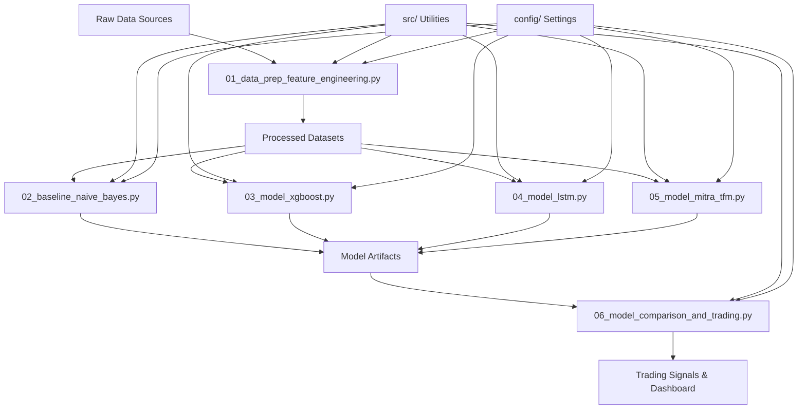

# Design Document

## Overview

The Forecasting Research Pipeline is a modular, notebook-based machine learning system designed for the Autonity/Forecastathon trading competition. The system processes diverse financial time-series data, performs comprehensive feature engineering, trains multiple model families (Naive Bayes, XGBoost, LSTM, Mitra), and generates actionable trading signals.

The architecture follows a research-first approach with six specialized Marimo notebooks, each handling a specific aspect of the machine learning pipeline. Marimo provides reactive execution, built-in interactivity, and pure Python files (.py) that are git-friendly and reproducible. The system emphasizes reproducibility, modularity, and rapid iteration while maintaining production-ready standards for error handling, testing, and observability.

## Architecture

### High-Level Architecture



### Directory Structure

```
forecasting-research-pipeline/
├── notebooks/
│   ├── 01_data_prep_feature_engineering.py    # Marimo notebook
│   ├── 02_baseline_naive_bayes.py             # Marimo notebook
│   ├── 03_model_xgboost.py                    # Marimo notebook
│   ├── 04_model_lstm.py                       # Marimo notebook
│   ├── 05_model_mitra_tfm.py                  # Marimo notebook
│   └── 06_model_comparison_and_trading.py     # Marimo notebook
├── src/
│   ├── data/
│   │   ├── __init__.py
│   │   ├── loaders.py
│   │   ├── preprocessors.py
│   │   └── validators.py
│   ├── features/
│   │   ├── __init__.py
│   │   ├── engineering.py
│   │   ├── technical_indicators.py
│   │   └── regime_detection.py
│   ├── models/
│   │   ├── __init__.py
│   │   ├── base_model.py
│   │   ├── naive_bayes.py
│   │   ├── xgboost_model.py
│   │   ├── lstm_model.py
│   │   └── mitra_model.py
│   ├── evaluation/
│   │   ├── __init__.py
│   │   ├── metrics.py
│   │   ├── calibration.py
│   │   └── explainability.py
│   ├── trading/
│   │   ├── __init__.py
│   │   ├── signals.py
│   │   └── portfolio.py
│   └── utils/
│       ├── __init__.py
│       ├── experiment_tracking.py
│       ├── logging_config.py
│       └── visualization.py
├── config/
│   ├── data_config.yaml
│   ├── model_config.yaml
│   ├── experiment_config.yaml
│   └── logging_config.yaml
├── data/
│   ├── raw/
│   ├── processed/
│   └── external/
├── models/
│   ├── naive_bayes/
│   ├── xgboost/
│   ├── lstm/
│   └── mitra/
├── experiments/
│   └── mlflow_runs/
├── logs/
│   ├── data_validation/
│   ├── model_training/
│   ├── pipeline_state/
│   └── errors/
├── tests/
│   ├── unit/
│   ├── integration/
│   └── reports/
├── requirements.txt
├── setup.py
└── README.md
```

## Components and Interfaces

### Data Processing Layer

**DataLoader Interface**
```python
class DataLoader:
    def load_csv(self, path: str, schema: Dict) -> pd.DataFrame
    def load_parquet(self, path: str) -> pd.DataFrame
    def validate_schema(self, df: pd.DataFrame, schema: Dict) -> ValidationResult
```

**Preprocessor Interface**
```python
class Preprocessor:
    def handle_missing_values(self, df: pd.DataFrame, strategy: str) -> pd.DataFrame
    def detect_outliers(self, df: pd.DataFrame, method: str) -> List[int]
    def resample_timeseries(self, df: pd.DataFrame, freq: str) -> pd.DataFrame
    def align_timeseries(self, dfs: List[pd.DataFrame]) -> pd.DataFrame
```

### Feature Engineering Layer

**FeatureEngineer Interface**
```python
class FeatureEngineer:
    def create_lag_features(self, df: pd.DataFrame, lags: List[int]) -> pd.DataFrame
    def calculate_rolling_stats(self, df: pd.DataFrame, windows: List[int]) -> pd.DataFrame
    def compute_technical_indicators(self, df: pd.DataFrame) -> pd.DataFrame
    def detect_regimes(self, df: pd.DataFrame, method: str) -> pd.DataFrame
    def create_calendar_features(self, df: pd.DataFrame) -> pd.DataFrame
```

### Model Layer

**BaseModel Interface**
```python
class BaseModel:
    def fit(self, X: pd.DataFrame, y: pd.Series, **kwargs) -> None
    def predict(self, X: pd.DataFrame) -> np.ndarray
    def predict_proba(self, X: pd.DataFrame) -> np.ndarray
    def save_model(self, path: str) -> None
    def load_model(self, path: str) -> None
    def get_feature_importance(self) -> Dict[str, float]
```

**MitraModel Interface**
```python
class MitraModel(BaseModel):
    def create_support_query_split(self, X: pd.DataFrame, y: pd.Series, 
                                  support_size: int) -> Tuple[pd.DataFrame, pd.DataFrame]
    def in_context_learning(self, support_X: pd.DataFrame, support_y: pd.Series,
                           query_X: pd.DataFrame) -> np.ndarray
    def adapt_to_regime(self, recent_data: pd.DataFrame, 
                       regime_examples: pd.DataFrame) -> None
```

### Evaluation Layer

**MetricsCalculator Interface**
```python
class MetricsCalculator:
    def calculate_classification_metrics(self, y_true: np.ndarray, 
                                       y_pred: np.ndarray) -> Dict[str, float]
    def calculate_regression_metrics(self, y_true: np.ndarray, 
                                   y_pred: np.ndarray) -> Dict[str, float]
    def calculate_trading_metrics(self, returns: np.ndarray, 
                                signals: np.ndarray) -> Dict[str, float]
    def calculate_calibration_metrics(self, y_true: np.ndarray, 
                                    y_proba: np.ndarray) -> Dict[str, float]
```

## Data Models

### Core Data Structures

**TimeSeriesData**
```python
@dataclass
class TimeSeriesData:
    timestamp: pd.DatetimeIndex
    features: pd.DataFrame
    targets: pd.Series
    metadata: Dict[str, Any]
    split_indices: Dict[str, List[int]]
```

**ModelArtifact**
```python
@dataclass
class ModelArtifact:
    model_id: str
    model_type: str
    model_object: Any
    hyperparameters: Dict[str, Any]
    training_metrics: Dict[str, float]
    validation_metrics: Dict[str, float]
    feature_importance: Dict[str, float]
    training_time: float
    created_at: datetime
```

**ExperimentRun**
```python
@dataclass
class ExperimentRun:
    run_id: str
    experiment_name: str
    parameters: Dict[str, Any]
    metrics: Dict[str, float]
    artifacts: List[str]
    status: str
    start_time: datetime
    end_time: Optional[datetime]
```

**TradingSignal**
```python
@dataclass
class TradingSignal:
    timestamp: datetime
    asset: str
    signal_type: str  # 'buy', 'sell', 'hold'
    confidence: float
    position_size: float
    model_source: str
    metadata: Dict[str, Any]
```

### Configuration Schemas

**DataConfig**
```yaml
data_sources:
  btc_price:
    path: "data/raw/btc_ohlcv.csv"
    schema:
      timestamp: "datetime64[ns]"
      open: "float64"
      high: "float64"
      low: "float64"
      close: "float64"
      volume: "float64"
  macro_indicators:
    path: "data/raw/macro_data.parquet"
    resample_freq: "1D"
    
preprocessing:
  missing_value_strategy: "forward_fill"
  outlier_detection_method: "iqr"
  outlier_treatment: "winsorize"
  
feature_engineering:
  lag_periods: [1, 2, 3, 5, 10, 20]
  rolling_windows: [5, 10, 20, 50]
  technical_indicators: ["rsi", "macd", "bollinger_bands"]
```

**ModelConfig**
```yaml
naive_bayes:
  discretization_bins: 10
  smoothing_alpha: 1.0
  
xgboost:
  hyperparameter_tuning:
    method: "optuna"
    n_trials: 100
    cv_folds: 5
  default_params:
    max_depth: 6
    learning_rate: 0.1
    n_estimators: 100
    
lstm:
  architecture:
    hidden_size: 128
    num_layers: 2
    dropout: 0.2
  training:
    batch_size: 32
    epochs: 100
    learning_rate: 0.001
    
mitra:
  autogluon_config:
    time_limit: 300
    presets: "best_quality"
  support_set_size: 100
  fine_tune_steps: 10
```
## Correctness Properties

*A property is a characteristic or behavior that should hold true across all valid executions of a system-essentially, a formal statement about what the system should do. Properties serve as the bridge between human-readable specifications and machine-verifiable correctness guarantees.*

Based on the prework analysis, the following correctness properties have been identified after eliminating redundancy:

**Property 1: Data serialization round-trip consistency**
*For any* processed dataset, feature definitions, model artifacts, or experiment configurations, serializing then deserializing should produce equivalent data structures with preserved metadata
**Validates: Requirements 1.4, 2.5, 3.3, 5.5, 6.5, 7.5, 10.1, 10.2, 10.3, 10.5**

**Property 2: Time series temporal ordering preservation**
*For any* time series data splitting or sequence generation operation, the resulting splits or sequences should never contain future information in training sets and should maintain strict temporal ordering
**Validates: Requirements 3.1, 3.2, 6.1, 6.3**

**Property 3: Feature engineering mathematical correctness**
*For any* input time series, generated features (lags, rolling statistics, technical indicators, volatility measures, correlations) should be mathematically correct according to their definitions
**Validates: Requirements 2.1, 2.2, 2.3, 2.4**

**Property 4: Data validation and preprocessing consistency**
*For any* input dataset with schema violations, missing values, or outliers, the preprocessing pipeline should handle them according to configuration while preserving data integrity and logging appropriate metrics
**Validates: Requirements 1.1, 1.2, 1.3, 1.5**

**Property 5: Model training and evaluation correctness**
*For any* trained model (Naive Bayes, XGBoost, LSTM, Mitra), the evaluation metrics should be calculated correctly and model artifacts should be complete with all required components
**Validates: Requirements 4.1, 4.3, 5.1, 5.2, 5.3, 6.2, 7.1, 7.2**

**Property 6: Mitra in-context learning adaptation**
*For any* market regime change, Mitra's predictions should adapt appropriately when provided with representative support examples from the new regime
**Validates: Requirements 7.4, 11.1, 11.2, 11.3, 11.4**

**Property 7: Ensemble and comparison consistency**
*For any* set of trained models, ensemble predictions should be correctly calculated from component models, and model comparisons should normalize metrics appropriately across different model types
**Validates: Requirements 8.1, 8.2, 8.3**

**Property 8: Trading signal generation correctness**
*For any* model predictions, the generated trading signals should correctly reflect the model outputs with appropriate position sizing and directional recommendations
**Validates: Requirements 8.4, 8.5**

**Property 9: Error handling and logging completeness**
*For any* system error (data validation failure, training error, pipeline failure, critical error), the appropriate structured logs should be generated with all required metrics and saved to the correct locations
**Validates: Requirements 12.1, 12.2, 12.3, 12.4, 12.5**

**Property 10: Experiment tracking and monitoring accuracy**
*For any* experiment run, all hyperparameters, metrics, and artifacts should be tracked correctly, and monitoring should trigger alerts when thresholds are exceeded
**Validates: Requirements 13.1, 13.2, 13.3, 13.5**

**Property 11: Configuration flexibility and validation**
*For any* valid configuration change (feature subsets, model parameters, split strategies, discretization methods), the system should adapt correctly while rejecting invalid configurations with helpful error messages
**Validates: Requirements 4.2, 4.5, 3.4, 10.4, 12.3**

## Error Handling

### Data Processing Errors

**Schema Validation Failures**
- Detect mismatched data types, missing required columns, invalid value ranges
- Log detailed validation reports with PSI scores for distribution shifts
- Implement graceful degradation with fallback data sources where possible

**Missing Data Handling**
- Support multiple imputation strategies: forward fill, backward fill, interpolation, mean/median
- Track missing data patterns and alert on excessive missingness (>30% for any feature)
- Preserve original data quality metrics for downstream analysis

**Outlier Detection and Treatment**
- Implement multiple detection methods: IQR, Z-score, Isolation Forest
- Support configurable treatment: winsorization, removal, transformation
- Log outlier statistics and treatment decisions for audit trails

### Model Training Errors

**Training Failures**
- Implement exponential backoff retry logic: max_retries=5, initial_backoff=2s, multiplier=2, ceiling=60s
- Save intermediate model states for debugging and recovery
- Capture full error context including hyperparameters and data characteristics

**Convergence Issues**
- Monitor training metrics for stagnation or divergence
- Implement early stopping with patience parameters
- Provide diagnostic information for hyperparameter adjustment

**Resource Constraints**
- Monitor memory usage and implement data batching for large datasets
- Implement model checkpointing for long-running training jobs
- Alert on resource exhaustion with recommended mitigation strategies

### Pipeline Orchestration Errors

**DAG Execution Failures**
- Save pipeline state at each successful node completion
- Implement resume-from-checkpoint functionality
- Log execution context including input parameters and environment variables

**Data Dependency Failures**
- Validate data availability before pipeline execution
- Implement dependency checking with clear error messages
- Support manual override for development and testing scenarios

## Testing Strategy

### Unit Testing Approach

The system will implement comprehensive unit tests focusing on:

**Data Processing Components**
- Test data loaders with various file formats and schemas
- Validate preprocessing functions with edge cases (empty data, single rows, extreme values)
- Test feature engineering functions with known mathematical properties

**Model Components**
- Test model interfaces with mock data to ensure consistent behavior
- Validate metric calculations against known ground truth values
- Test serialization/deserialization for all model types

**Utility Functions**
- Test configuration parsing and validation logic
- Validate logging and experiment tracking functionality
- Test error handling and retry mechanisms

### Property-Based Testing Approach

The system will use **Hypothesis** as the property-based testing library, configured to run a minimum of 100 iterations per property test.

**Core Properties Implementation**
Each correctness property will be implemented as a separate property-based test with the following structure:

```python
from hypothesis import given, strategies as st
import pytest

@given(st.data())
def test_property_1_serialization_roundtrip(data):
    """
    **Feature: forecasting-research-pipeline, Property 1: Data serialization round-trip consistency**
    """
    # Generate random dataset/model/config
    original_data = generate_test_data(data)
    
    # Serialize then deserialize
    serialized = serialize_data(original_data)
    deserialized = deserialize_data(serialized)
    
    # Assert equivalence
    assert_data_equivalent(original_data, deserialized)
```

**Property Test Configuration**
- Minimum 100 iterations per property test
- Custom generators for financial time series data, model configurations, and trading scenarios
- Shrinking strategies to find minimal failing examples
- Seed control for reproducible test failures

**Integration with CI/CD**
- Property tests run on every commit and pull request
- Failed property tests block merges with detailed failure reports
- Performance regression detection for property test execution time

### Test Coverage Requirements

**Coverage Thresholds**
- Minimum 80% line coverage for all source code
- 100% coverage for critical paths (data validation, model serialization, trading signal generation)
- Branch coverage tracking for conditional logic

**Coverage Reporting**
- Generate HTML coverage reports saved to `tests/reports/coverage/`
- Track coverage trends over time with alerts for significant decreases
- Exclude test files and generated code from coverage calculations

**Integration Testing**
- End-to-end workflow tests for each notebook execution path
- Cross-component integration tests for data flow between notebooks
- Performance benchmarks for full pipeline execution on sample datasets

The dual testing approach ensures both concrete correctness (unit tests) and general robustness (property tests), providing comprehensive validation of the forecasting pipeline's reliability and accuracy.